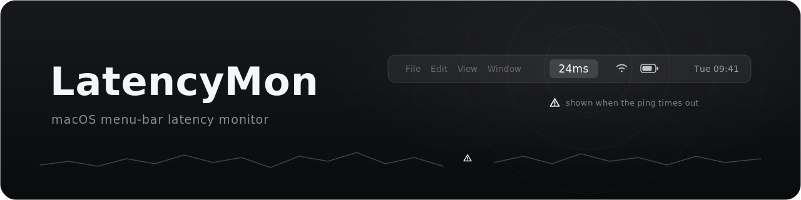

<div align="center">



# LatencyMon

**A tiny, monochrome macOS menu-bar app that shows round-trip latency to a host you choose.**

Built for glancing at SSH connection health on a train — `24ms` when the link is good, a white ⚠ caution triangle when it times out. No colors, no clutter.


**[Homepage](https://adambenhassen.github.io/mac-latency-mon/)** · **[Download](https://github.com/adambenhassen/mac-latency-mon/releases/latest)**

</div>

## Features

- **At-a-glance latency** — live round-trip time to your chosen host, right in the menu bar.
- **Monochrome by design** — white `24ms` when reachable, a white caution triangle on timeout. Nothing else.
- **Configurable target** — set any IP or hostname from the menu; remembered across launches.
- **Adjustable interval** — ping every 0.1s / 0.5s / 1s / 2s / 5s / 10s.
- **Launch at login** — one toggle, via the native `SMAppService` login item.
- **Zero dependencies** — a single Swift file compiled with `swiftc`. No Python, no SwiftBar, no packages.

## Install

Requires macOS 13+ and the Xcode command-line tools (`xcode-select --install`).

```sh
git clone https://github.com/adambenhassen/mac-latency-mon.git
cd mac-latency-mon
./build.sh          # compiles main.swift → LatencyMon.app
open LatencyMon.app # launches it (menu-bar only, no Dock icon)
```

To keep the **Launch at Login** toggle sticky, move `LatencyMon.app` into `/Applications`
before enabling it — macOS drops login items whose app path keeps changing.

## Usage

Click the menu-bar item:

| Item | What it does |
| --- | --- |
| **Set IP…** | Enter your SSH host or IP to monitor. |
| **Interval** | Choose how often it pings (0.1s–10s). |
| **Launch at Login** | Start LatencyMon automatically at login. |
| **Quit** | Exit the app. |

The target host and interval persist across launches (`UserDefaults`).

## How it works

A repeating timer shells out to `/sbin/ping -c 1` on a background queue, parses the
`time=` value from the reply, and updates the menu-bar title on the main thread. A
non-zero exit or missing reply within the ~1s budget renders the caution triangle
instead — errors are never silently shown as `0ms`. `/sbin/ping` needs no root on macOS.

## License

[MIT](LICENSE)
